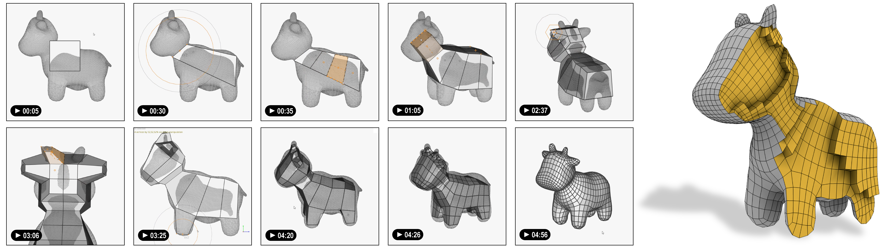

# HexBox: Interactive Box Modeling of Hexahedral Meshes

<p align="center"></p>

HexBox is an intuitive modeling method and interactive tool for creating and editing hexahedral meshes.
Hexbox brings the major and widely validated surface modeling paradigm of surface box modeling into the world of hex meshing.
This is the reference implementation of the paper

[***HexBox: Interactive Box Modeling of Hexahedral Meshes***]() </br>
F. Zoccheddu, [E. Gobbetti](https://www.crs4.it/peopledetails/8/enrico-gobbetti/), [M. Livesu](http://pers.ge.imati.cnr.it/livesu/), [N. Pietroni](https://www.nicopietroni.com), [G. Cherchi](http://www.gianmarcocherchi.com)</br>
_Computer Graphics Forum (SGP 2023)_.

## Setup

1. Clone this repository:

```Shell
git clone https://github.com/gcherchi/HexBox.git
cd HexBox
```

2. Generate the build system:

```Shell
mkdir build
cd build
cmake ..
```

3. Build:

```Shell
cmake --build .
```

4. Run the `gui` executable.

5. Enjoy! 😉

## Compatibility

HexBox requires [CMake](https://cmake.org/) 3.14+, a modern C++20 compiler, and OpenGL 2.0.<br>
It has been successfully tested on MSVC v143 on Windows 11, GCC 10 and Clang 14 on Ubuntu 22.10 and Clang14 on MacOS.

## Videos

On [this page](/videos/videos.md), you can watch several videos showing the modeling sessions of the images in our paper (and more...). 

## Cyting us

If you use HexBox on your projects, please consider citing our paper using the following BibTeX entry: 

```bibtex
@article{hexbox2023,
  title   = {HexBox: Interactive Box Modeling of Hexahedral Meshes},
  author  = {Zoccheddu, F. and Gobbetti, E. and Livesu, M. and Pietroni, N. and Cherchi, G.},
  journal = {Computer Graphics Forum},
  year    = {2023},
  volume  = {},
  number  = {},
  pages   = {},
  doi     = {},
}
```


